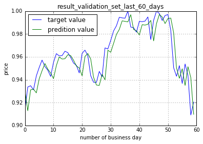

# stock-tensorflow

[`TensorFlow` and `TensorBoard`] 

**Goal:**  
Using S&amp;P500 historical data from yahoo finance to predict S&amp;P500 price for the next day  

**Raw Data:**   
S&amp;P500 historical data from yahoo finance (1980.01.02 - 2017.11.17)

**ML Algorithms (implemented by TensorFlow):**  
Feedforward Artificial Neural Network.

**Plotting:**  
matplotlib  

**Envs:**  
Anaconda and Python 3.5  

**TensorFlow Install:**  
https://www.tensorflow.org/install/  

**Packages:**   
```  
conda install numpy pandas matplotlib  
conda install spyder  
```  

**Run Steps:**  
```  
git clone https://github.com/jasonx1011/stock-tensorflow.git  
python stock.py  
``` 
or
using `spyder` to run stock.py (Recommended)  

**Sample Outputs:**  
   * Plotting Outputs:  
  
  
  
  

**Results (results may fluctuate):**
Final total_loss:  
  
loss_train = 0.944, lr_1E-03,2000,32,h_layers_16_32  
loss_valid = 2.311, lr_1E-03,2000,32,h_layers_16_32  
runtime = 3.496 (mins)  
  
Naive model:  
Final total_loss:  
  
loss_train = 4.243  
loss_valid = 9.078  

**Program Flow:**  
   * import raw data (`pandas`)  
   * preprocess data (`pandas` & `numpy`)  
   * multiple features  
   * no normalization & shuffle for training  
      * the idea is to preserve the time series information or pattern  
   * build mlp_net (`TensorFlow`)  
   * build the graph and train (`TensorFlow` & `TensorBoard`)  
   * run grid search for fine tuning hyperparameters (learning rate, batch size, hidden layers, features ...etc)  
   * compare results with Naive Model  
      * Naive Model: simply take mean() of the features as the prediction value  
   * output tensorboard meta-data or txt logs or images  
   * explore the data of multple runs by using `TensorBoard`  
