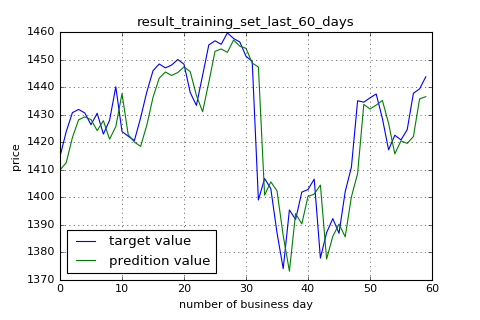
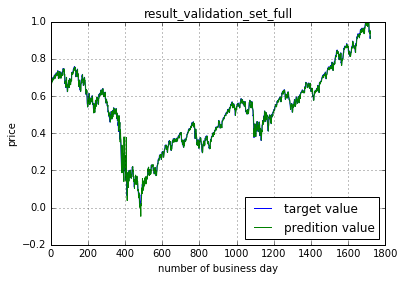

# stock-tensorflow

[implemented by TensorFlow] 

**Goal:**  
Using S&amp;P500 historical data from yahoo finance to predict S&amp;P500 price for the next day  

**Raw data:**   
S&amp;P500 historical data from yahoo finance (1980.01.02 - 2017.11.17)

**ML algorithms (implemented by TensorFlow):**  
Feedforward Artificial Neural Network.

**Plotting:**  
matplotlib  

**Envs:**  
Anaconda and Python 3.5  

**TensorFlow Install:**  
https://www.tensorflow.org/install/  

**Packages:**   
conda install numpy pandas matplotlib  
conda install spyder  

**Run Steps:**  
% git clone https://github.com/jasonx1011/stock-tensorflow.git  
% python stock.py  
or
using **spyder** to run stock.py (Recommended)  

**Sample Outputs:**  
   * Plotting Outputs:  
  
  
  
  

